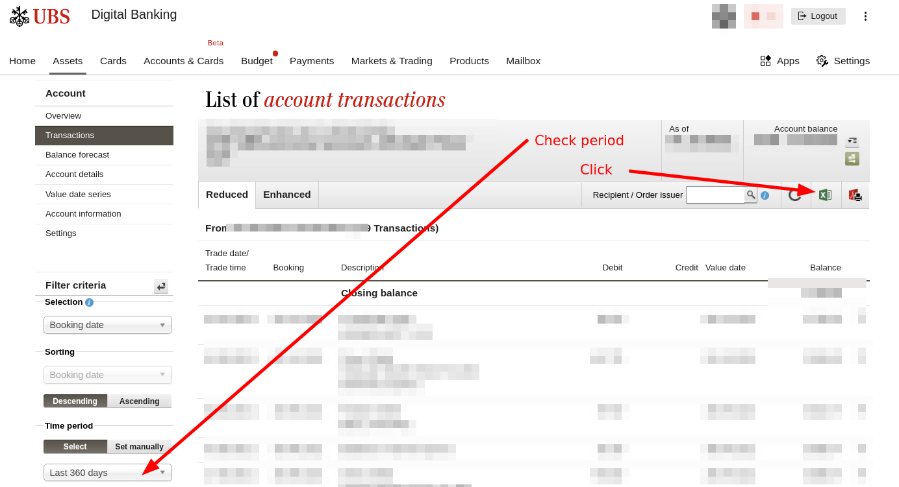
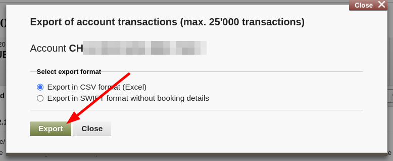

# Reconciler

Helps reconciling GnuCash with external systems by matching them to transaction
IDs in external systems.

Currently can match GnuCash accounts to a user's part in a Splitwise group,
or a checking account with UBS.

The matching is done by adding `splitwise=12345` into the notes field in GnuCash,
where `12345` is the Splitwise expense ID.

```bash
bazel run //finance/reconcile | tee output.txt
```

Expects some configuration in `~/.config/ducktape/config.yaml`.

## Downloading transaction CSV from UBS

1. Accounts & Cards → Account transactions


1. Download CSV, PDF, SWIFT


1. Check that "Time period" is appropriate.
   Click "Excel" icon.



1. Export (in CSV format)


